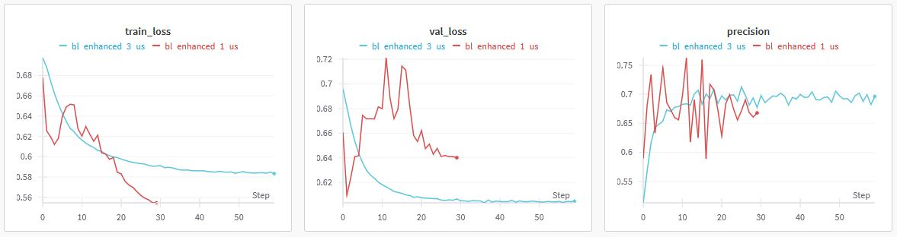
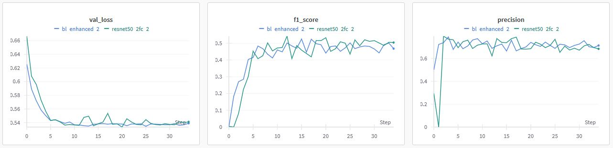
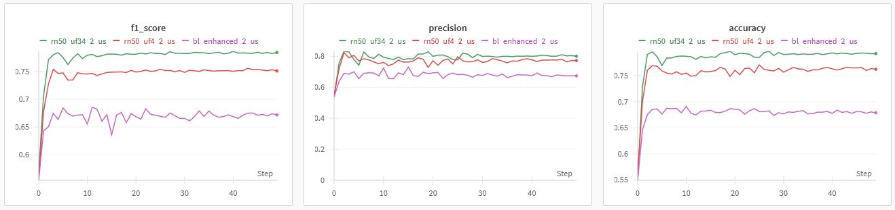
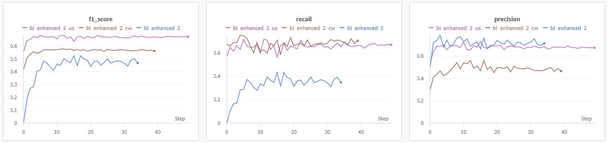
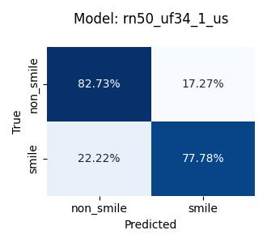
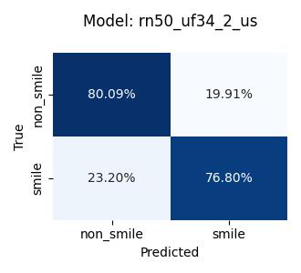
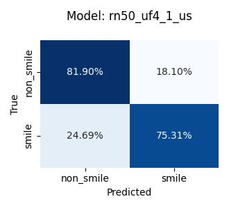
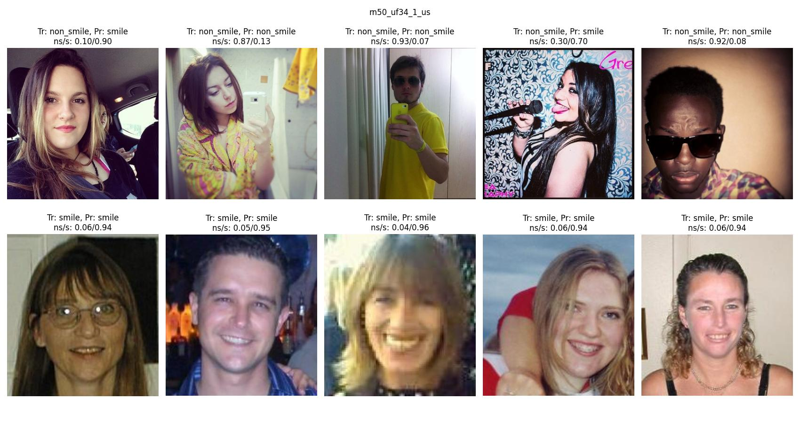

# Learning from Images: Smile Classifier

A binary image classification model that can distinguish between non-smiling and smiling people has been trained.  
The model is based on [ResNet-50](https://arxiv.org/abs/1512.03385) and pretrained with PyTorch’s [IMAGENET1K_V2 weights](https://pytorch.org/vision/main/models/generated/torchvision.models.resnet50.html).
The datasets used for training are [GENKI-4k](https://inc.ucsd.edu/mplab/398/) (4,000 pictures) and the [UCF Selfie Data Set](https://www.crcv.ucf.edu/data/Selfie/) (46,836 pictures).  
Models were trained utilizing various hyper parameter combinations and different data imbalance mitigation techniques. Training and testing of 30 parameter combinations was logged and can be explored via wandb:
- training runs: https://wandb.ai/chr_te/LfI24/workspace
- evaluations on testset: https://wandb.ai/chr_te/LfI24_test/table

Within a [dummy app](app/) the [best model](/train/results/colab/rn50_uf34_1_us_final.pth) was used for classifying a short video:

https://github.com/tesch-ch/lfi_24/assets/134967675/d13abb66-f71b-4afb-9a46-bc3800085961

## Motivation
- pytorch
- neuroscience
- everyday world

## Methodology

### Dataset Selection
Two datasets were identified that were already labeled in non_smile and smile.

#### GENKI-4k
[This dataset](https://inc.ucsd.edu/mplab/398/) holds 4,0000 pictures and it can be directly downloaded [here](https://inc.ucsd.edu/mplab/398/media/genki4k.tar). 54 % of the pictures are labelled as smiling. So, we consider the dataset rather balanced. Here are 10 sampled pictures from the dataset:

  

In the first row, we see pictures labelled as smile and in the second non_smile. Many of the pictures in this dataset have somewhat of a portrait aspect to them, and these pictures seem to predate the selfie era.

#### UCF Selfie Data Set
The dataset holds 46,836 pictures and can be directly downloaded [here](https://www.crcv.ucf.edu/data/Selfie/Selfie-dataset.tar.gz). It's an imbalanced dataset, where 74 % of pictures are labelled non_smiling. The pictures were downloaded from Instagram in 2015. Here are 10 samples from the dataset:

  

The first row features pictures which are labelled as smiling, the second row is labelled non_smiling.
This dataset was labelled by multiple people, which could be the reason that subtle smiles sometimes seem to be labelled as non_smiling  and sometimes as smiling. But, this report is not about the question "what is a smile".  
A positive aspect is that the data is not as “uniform” as the GENKI set. There are many different backgrounds, people’s faces are photographed from different angles, etc. This might lead to better generalization, even without heavy data augmentation.

### Data Preprocessing and Exploration
The data preprocessing and a minimal data exploration is performed in the [preprocessing notebook](data/preprocess.ipynb). Both datasets come with their respective documentation, which makes loading the data and reorganizing relatively straight forward.  
Both datasets are combined (referred to as the dataset from now on) and split 70-30-30 into training, validation and test sets. A zip archive is created, as this simplifies later on processing via Google Colab. In [`data/dataset_mini/`](data/dataset_mini/) you can find a dummy dataset, with 8 images per class and split.  
Another thing to mention is, that almost all images are more or less square, this simplifies data loading and preprocessing in the model later on (ResNet's usual input image size is 224x224).

As already established, the dataset is heavily imbalanced. There are approximately 22,000 more non_smile images (count: 36,467) than there are smile images (count: 14,369), which proved to be problematic in training.  
This imbalance is mitigated in the preprocessing notebook by calculating class weights and by under sampling the majority class, i.e. dropping a random selection of 22,000 non_smile images and creating another dataset. More on this in the training section.

Download links to the preprocessed datasets:
- unbalanced dataset (50,836 images): https://drive.google.com/file/d/15kxltmK0N3-0VuYRc1mx6frHcmzi-VPk/view?usp=sharing
- balanced dataset (under sampled, 28,738 images): https://drive.google.com/file/d/159296BtrbBTn7nBarCyCG3Iex4QrQHyC/view?usp=sharing

### Base Model
For the transfer learning task at hand, ResNet-50 is chosen as base model. It offers a great compromise between performance and hardware requirements. The base model's details can be obtained [here](https://pytorch.org/vision/main/models/generated/torchvision.models.resnet50.html). PyTorch's IMAGENET1K_V2 weights are used.

### Training
The training routine is implemented in [`trainer.py`](train/trainer.py), in the same file the ResNet-50 based models are defined:
- ``ModelBaseline``
  - Layers 1-4 frozen (there are 4 in total)
  - Custom fully connected layer (two output nodes)
  - training run prefix: baseline, bl, or bl_enhanced
- ``ResNet50Based2FC``
  - Layers 1-4 frozen
  - Custom two fully connected layers (ReLU activated, two output nodes)
  - training run prefix: resnet50_2fc
- ``ResNet50Lr4``
  - Layers 1-3 frozen
  - Custom fully connected layer (two output nodes)
  - training run prefix: rn50_uf4
- ``ResNet50Lr34``
  - Layers 1 and 2 frozen
  - Custom fully connected layer (two output nodes)
  - training run prefix: rn50_uf34

All models feature two output nodes. Only one output node would suffice for the project's binary classification task, but two nodes allow for [PyTorch's cross entropy loss](https://pytorch.org/docs/stable/generated/torch.nn.CrossEntropyLoss.html) as loss function. This implementation enables us to directly perform class weighting as mitigation against imbalanced data, and label smoothing.  
The training script allows for the following hyper parameters to be set, as optimizer [SGD](https://pytorch.org/docs/stable/generated/torch.optim.SGD.html) is fixed:
- batch size
- epochs
- Optimizer:
  - momentum
  - learning rate (lr)
  - weight_decay
- lr scheduler:
  - cosine annealing lr (yes/no)
  - the number of linear lr warmup epochs
- label smoothing
- class weights

The training is performed via Google Colab utilizing A100 GPU sessions, the respective notebooks can be found in [`train/colab_notebooks/`](train/colab_notebooks/).
All training runs are logged and interactively displayed [here](https://wandb.ai/chr_te/LfI24/workspace) (publicly accessible). Additionally, all these logs with the obtained models are also locally stored in [`train/results/colab`](train/results/colab). A quick overview can also be accessed in [`testset_results.csv`](train/results/test_set_results/testset_results.csv).

[Here](https://pytorch.org/blog/how-to-train-state-of-the-art-models-using-torchvision-latest-primitives/) is a recipe on training ResNet-50 that inspired most of the hyperparameter configurations.
The proposed high lr=0.5 did work for the dataset at hand, especially when working with a frozen model (besides the fully connected layer).  

Models were trained either on the imbalanced set (no suffix in the run name), or the smaller balanced set (suffix `_us` in the run name).

## Results and Evaluation
The models are evaluated on the balanced test set in [test_models.ipynb](train/colab_notebooks/test_models.ipynb). The evaluation results are stored in [`test_set_results/`](train/results/test_set_results). This directory contains for every evaluated model a confusion matrix, detailed predictions on every image with the respective model confidence, and a collage of 10 labelled pictures. There is an overview of the results in [`testset_results.csv`](train/results/test_set_results/testset_results.csv), or simply interactively explore the results [here](https://wandb.ai/chr_te/LfI24_test/table).

In the following sections, some effects of selected hyperparameters on model training and performance are highlighted in a qualitative way. For comparing the actual metrics checkout the [training logs](https://wandb.ai/chr_te/LfI24/workspace).

### Learning Rate
The learning rate had a substantial effect on training, especially stability. The recipe suggested lr=0.5, this was way to high for the models with frozen layers 1-4. Models with unfrozen layer 3, or 3 and 4 handled higher learning rates such as 0.1 better. 

  

Here we see a baseline model that is trained with lr=0.1 (red) and the training is highly instable, whereas training with lr=0.001 on the same parameters (blue) is way more stable.

### One vs Two Fully Connected Output Layers

  

The graphic show two training runs with the same hyperparameters, one with two fully connected output layers (resnet50_2fc_2, green), the other with one fully connected layer (bl_enhanced_2, blue). In all the training runs, no significant difference could be made out between the depth of the output layer. Hence, models with only one output layer were pursued further.

### Unfreezing Main Stages
ResNet-50 features 4 main stages (in PyTorch called layer 1-4). Unfreezing layer 4 or layer 3 and 4 boosted overall performance significantly, as can be seen e.g. in training on the validation metrics:

  

All hyperparameters are the same here, only the unfreezing of layers is changed. The worst scores are achieved by the model utilizing no unfreezing of the main stages (magenta), the models with an unfrozen layer 4 (red) performs significantly better, the model with unfrozen layer 3 and 4 (green) outperforms both other models in all of the metrics.

The overall impact on the training duration with the additionally unfrozen main stages was not that high (approximately 20 % longer).

### Mitigating Imbalance (Class Weighting, Imbalanced vs Balanced Dataset)
PyTorch's DataLoader encoded non_smiling as 0 and smiling as 1. So, e.g. recall (sensitivity) is associated with smiling. 
Initially, only the imbalanced dataset was used, the hope here being that working with a pretrained model, the imbalance might not have that big of an effect. This did not turn out to be the case, models generally performed bad on recall (<0.4).  
Using higher class weights for the minority class (smiling) in the cross entropy loss function significantly boosted F1 score and recall.
Simply training on the balanced dataset had an even bigger positive effect, even though a considerable amount of training data was dropped. This highlights the importance of data quality:

  

All three models utilize the same setup, only bl_enhanced_2_cw (brown) uses class weights. bl_enhanced_2 (blue) and bl_enhanced_2_cw were trained on the imbalanced dataset, bl_enhanced_2_us (magenta) was trained on the under sampled (balanced) dataset.
In the validation F1 score, the model trained on the balanced dataset clearly outperforms the other models, followed by the model with weighted classes. The model trained on the imbalanced dataset performs worst in F1.  
The model trained on the imbalanced dataset performs the worst in recall, which was to be expected.
This could be mitigated by utilizing class weights, but, this lowered the model's precision.  
Simply training on the balanced dataset however, makes the model perform best in the F1 score, and there is no significant diminished precision.

### Model Ranking by Balanced Test Set F1 Score
The following table features the top 5 models based on the balanced test set F1 score:

| Run name       | Architecture     | f1  | accuracy | precision | recall |    lr | batch_size | class_weights | epochs | label_smoothing | momentum | warmup_epochs | warmup_lr_decay | weight_decay | useCosineAnnealingLR |
|----------------|----------------|-----|----------|-----------|--------|-------|------------|---------------|--------|-----------------|----------|---------------|-----------------|--------------|----------------------|
| rn50_uf34_1_us | resnet50_lay34 | 0.80 | 0.80     | 0.82      | 0.78   | 0.100 | 128        |     (1, 1)   | 50     | 0.1             | 0.9      | 5             | 0.01            | 0.00002      | true                 |
| rn50_uf34_2_us | resnet50_lay34 | 0.78 | 0.78     | 0.79      | 0.77   | 0.010 | 128        |     (1, 1)   | 50     | 0.1             | 0.9      | 5             | 0.01            | 0.0001       | true                 |
| rn50_uf4_1_us  | resnet50_lay4  | 0.78 | 0.79     | 0.81      | 0.75   | 0.100 | 128        |     (1, 1)   | 50     | 0.1             | 0.9      | 5             | 0.01            | 0.00002      | true                 |
| rn50_uf34_4_us | resnet50_lay34 | 0.77 | 0.78     | 0.81      | 0.74   | 0.0005| 128        |      (1, 1)  | 50     | 0.1             | 0.9      | 5             | 0.01            | 0.0001       | true                 |
| rn50_uf34_3_us | resnet50_lay34 | 0.76 | 0.76     | 0.77      | 0.75   | 0.001 | 128        |     (1, 1)   | 50     | 0.1             | 0.9      | 5             | 0.01            | 0.0001       | true                 |

  
  
  
  
  

All the top performing models were trained on the balanced dataset and feature unfrozen main stages. The top 5 models perform generally well on the test set.

### Best Model's Output
These are example outputs of the best model rn50_uf34_1_us:

  

Images in the first row are all in the test set's non_smile class. The first and fourth image were misclassified by the model as smile.
Personally, I'd consider the first image to be a subtle smile, and also the fourth image could be considered a smile. All the smiles in the second row were correctly predicted.
It should be mentioned, that the first row originates from the UCF dataset, the second rows from GENKI and intuitively I would consider the GENKI images to be easier predicted.  

This should not imply that the model overall tends to predict smiles significantly more often as can be seen in above confusion matrix.  
A short video I recorded was classified [here](app/classified.mp4) and the predictions perfectly agree to my understanding of "how smiling works".

### Critique on Test Set
dfdf

## Conclusion and Future Work
- train model from ground up
- Use hyper parameter sweeps (e.g. RayTune)
- Data Augmentation e.g. random cropping, horizontal flipping, and color jittering.
- with face object detection find faces in dataset and crop...

