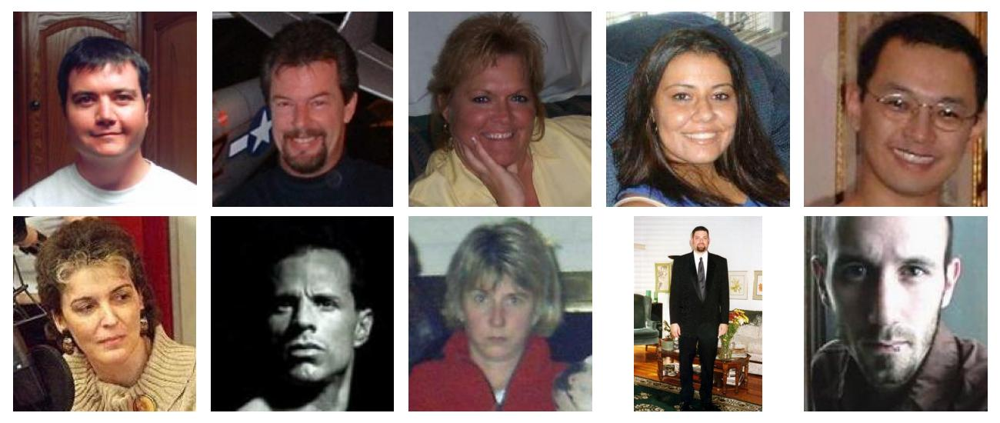
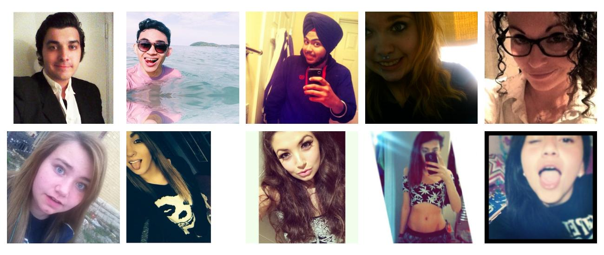

# Learning from Images: Smile Classifier

A binary image classification model that can distinguish between non-smiling and smiling people has been trained.  
The model is based on [ResNet-50](https://arxiv.org/abs/1512.03385) and pretrained with PyTorch’s [IMAGENET1K_V2 weights](https://pytorch.org/vision/main/models/generated/torchvision.models.resnet50.html).
The datasets used for training are [GENKI-4k](https://inc.ucsd.edu/mplab/398/) (4,000 pictures) and the [UCF Selfie Data Set](https://www.crcv.ucf.edu/data/Selfie/) (46,836 pictures).  
Models were trained utilizing various hyper parameter combinations and different data imbalance mitigation techniques. Training and testing of 30 parameter combinations was logged and can be explored via wandb:
- training runs: https://wandb.ai/chr_te/LfI24/workspace
- evaluations on testset: https://wandb.ai/chr_te/LfI24_test/table

Within a [dummy app](app/) the [best model](/train/results/colab/rn50_uf34_1_us_final.pth) was used for classifying a short video:

https://github.com/tesch-ch/lfi_24/assets/134967675/d13abb66-f71b-4afb-9a46-bc3800085961

## Motivation
- pytorch
- neuroscience
- everyday world

## Methodology

### Dataset Selection
Two datasets were identified that were already labeled in non_smile and smile.

#### GENKI-4k
[This dataset](https://inc.ucsd.edu/mplab/398/) holds 4,0000 pictures and it can be directly downloaded [here](https://inc.ucsd.edu/mplab/398/media/genki4k.tar). 54 % of the pictures are labelled as smiling. So, we consider the dataset rather balanced. Here are 10 sampled pictures from the dataset:
<p align="center">
  
</p>
In the first row, we see pictures labelled as smile and in the second non_smile. Many of the pictures in this dataset have somewhat of a portrait aspect to them, and these pictures seem to predate the selfie era.

#### UCF Selfie Data Set
The dataset holds 46,836 pictures and can be directly downloaded [here](https://www.crcv.ucf.edu/data/Selfie/Selfie-dataset.tar.gz). It's an imbalanced dataset, where 74 % of pictures are labelled non_smiling. The pictures were downloaded from Instagram in 2015. Here are 10 samples from the dataset:
<p align="center">
  
</p>

The first row features pictures which are labelled as smiling, the second row is labelled non_smiling.
This dataset was labelled by multiple people, which could be the reason that subtle smiles sometimes seem to be labelled as non_smiling  and sometimes as smiling. But, this report is not about the question "what is a smile".  
A positive aspect is that the data is not as “uniform” as the GENKI set. There are many different backgrounds, people’s faces are photographed from different angles, etc. This might lead to better generalization, even without heavy data augmentation.

### Data Preprocessing and Exploration
The data preprocessing and a short exploration is in detail described in the [preprocessing notebook](data/preprocess.ipynb). Both datasets come with their respective documentation, which makes loading the data and reorganizing relatively straight forward.  
The datasets are combined (referred to as the dataset from now on) and split 70-30-30 into training, validation and test sets. A zip archive is created, as this simplifies later on processing via Google Colab. In [`data/dataset_mini/`](data/dataset_mini/) you can find a dummy dataset, with 8 images per class and split.  
Another thing to mention is, that almost all images are more or less square, this simplifies data loading and preprocessing in the model later on (ResNet's usual input image size is 224x224).

As already established, the dataset is heavily imbalanced. There are approximately 22,000 more non_smile images (count: 36,467) than there are smile images (count: 14,369), which proofed to be problematic in training.  
This imbalance is mitigated in the preprocessing notebook by calculating class weights and by under sampling the majority class, i.e. dropping a random selection of 22,000 non_smile images. More on this in the training section.

Download links to the preprocessed datasets:
- unbalanced dataset (50,836 images): https://drive.google.com/file/d/15kxltmK0N3-0VuYRc1mx6frHcmzi-VPk/view?usp=sharing
- balanced dataset (28,738 images): https://drive.google.com/file/d/159296BtrbBTn7nBarCyCG3Iex4QrQHyC/view?usp=sharing


### Base Model
For the transfer learning task at hand, ResNet-50 is chosen as base model. It offers a great compromise between performance and hardware requirements. The base model's details can be obtained [here](https://pytorch.org/vision/main/models/generated/torchvision.models.resnet50.html). PyTorch's IMAGENET1K_V2 weights are used.


## Training
The training routine is implemented in [`train/trainer.py`](train/trainer.py), in the same file the ResNet-50 based models are defined:
- ``ModelBaseline``
  - Layers 1-4 frozen (there are 4 in total)
  - Custom fully connected layer (two output nodes)
  - training run prefix: baseline, bl, or bl_enhanced
- ``ResNet50Based2FC``
  - Layers 1-4 frozen
  - Custom two fully connected layers (ReLU activated, two output nodes)
  - training run prefix: resnet50_2fc
- ``ResNet50Lr4``
  - Layers 1-3 frozen
  - Custom fully connected layer (two output nodes)
  - training run prefix: rn50_uf4
- ``ResNet50Lr34``
  - Layers 1 and 2 frozen
  - Custom fully connected layer (two output nodes)
  - training run prefix: rn50_uf34

All models feature two output nodes. Only one output node would suffice for the project's binary classification task, but two nodes allow for [PyTorch's cross entropy loss](https://pytorch.org/docs/stable/generated/torch.nn.CrossEntropyLoss.html) as loss function. This implementation enables us to directly perform class weighting as mitigation against imbalanced data, and label smoothing.  
The training script allows for the following hyper parameters to be set, as optimizer [SGD](https://pytorch.org/docs/stable/generated/torch.optim.SGD.html) is fixed:
- batch size
- epochs
- Optimizer:
  - momentum
  - learning rate (lr)
  - weight_decay
- lr scheduler:
  - cosine annealing lr (yes/no)
  - linear lr warmup
  - warmup epochs
- label smoothing
- class weights

The training is performed via Google Colab utilizing A100 GPU sessions, the respective notebooks can be found in [`train/colab_notebooks/`](train/colab_notebooks/). All training runs are logged and interactively displayed [here](https://wandb.ai/chr_te/LfI24/workspace), and publicly accessible.


- training pipeline
- logging to wandb but also logging everything locally, storing the models as pth


## stuff
- UCF contains some notion of ethnicity (would allow for checking if PoC are included in data...)
- with face object detection find faces in dataset and crop...
- model trained only on genki...
- Data augmentation
  - Standard data augmentation techniques for training on ImageNet include random cropping, horizontal flipping, and color jittering. The images are also resized to 224x224 pixels after augmentation.
  - But, images are goofy anyways, so might not need be super important
  - e.g. (torchvision transforms):
    ```python
    train_transforms = transforms.Compose([
        transforms.Resize((224,224)),
        transforms.RandomAffine(degrees=15, translate=(0.1,0.1), scale=(0.8,1.2), shear=5),
        transforms.RandomHorizontalFlip(),
        transforms.ToTensor(),
        normalize])
    test_transforms = transforms.Compose([
        transforms.Resize((224,224)),
        transforms.ToTensor(),
        normalize])
    ```
- A big advantage of cosine is that there are no hyper-parameters to optimize, which cuts down our search space. (https://pytorch.org/blog/how-to-train-state-of-the-art-models-using-torchvision-latest-primitives/)
- Choose two output neurons for better comparison between model's probabilities (softmax, cross entropy loss...)
- One vs two output neurons
- RayTune in the future...
- Data might be imbalanced in many ways, such as underrepresented smiling males...

